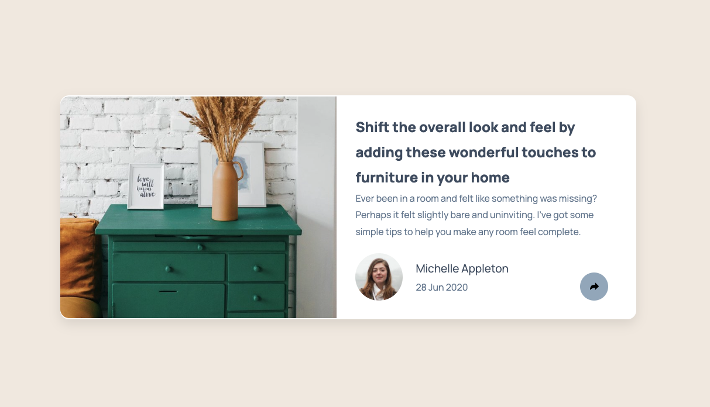
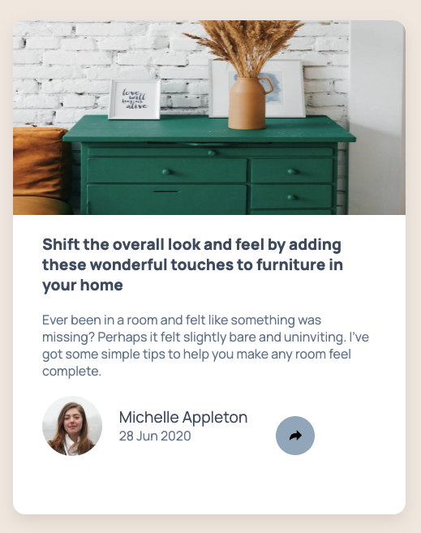

# Frontend Mentor - Article preview component solution

This is a solution to the [Article preview component challenge on Frontend Mentor](https://www.frontendmentor.io/challenges/article-preview-component-dYBN_pYFT). Frontend Mentor challenges help you improve your coding skills by building realistic projects. 

## Table of contents

- [Overview](#overview)
  - [The challenge](#the-challenge)
  - [Screenshot](#screenshot)
  - [Links](#links)
- [My process](#my-process)
  - [Built with](#built-with)
- [Author](#author)

## Overview

### The challenge

Users should be able to:

- View the optimal layout for the component depending on their device's screen size
- See the social media share links when they click the share icon

### Screenshot

### Links

- Solution URL: [Add solution URL here](https://www.frontendmentor.io/solutions/article-preview-component-master-dqj5htQHX0)
- Live Site URL: [Add live site URL here](https://jj-codes-9.github.io/article-preview-component-master/
)

## My process
The biggest challenge was figuring out how to create the interaction that enables the popup to toggle when clicked. It required a good understanding of JavaScript and how to manipulate the DOM dynamically. Another challenge was making the layout responsive, especially ensuring the elements align properly in mobile view. I tackled these by breaking the problems into smaller steps—debugging and testing the popup logic separately before integrating it—and refining the CSS media queries for better responsiveness.

### Built with
- Semantic HTML5 markup
- CSS custom properties
- Flexbox
- CSS Grid
- Mobile-first workflow

## Author

- Website - [jj-codes-9](https://www.jjatwork.com)
- Frontend Mentor - [@JJ-codes-9](https://www.frontendmentor.io/profile/JJ-codes-9)
